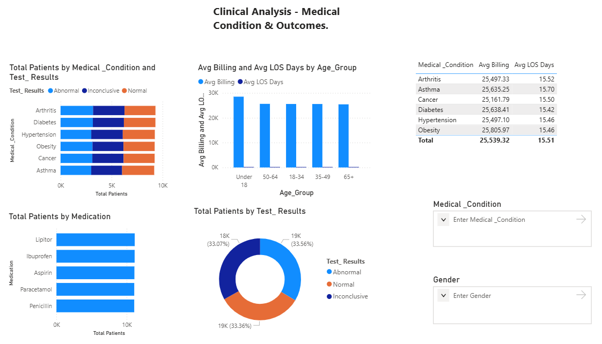
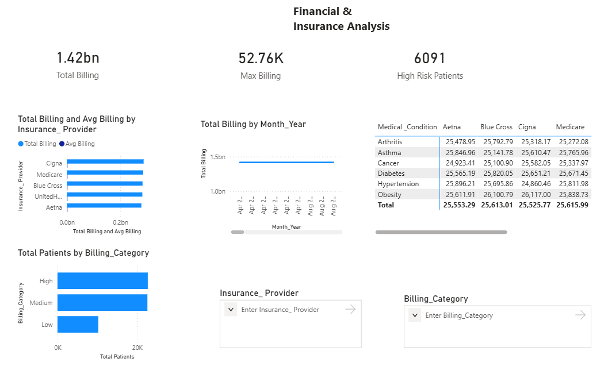
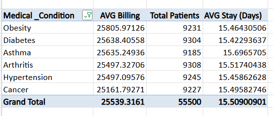
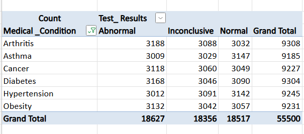
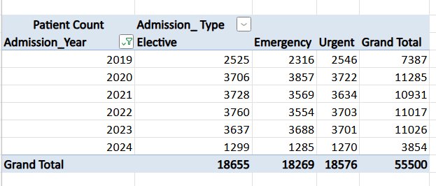
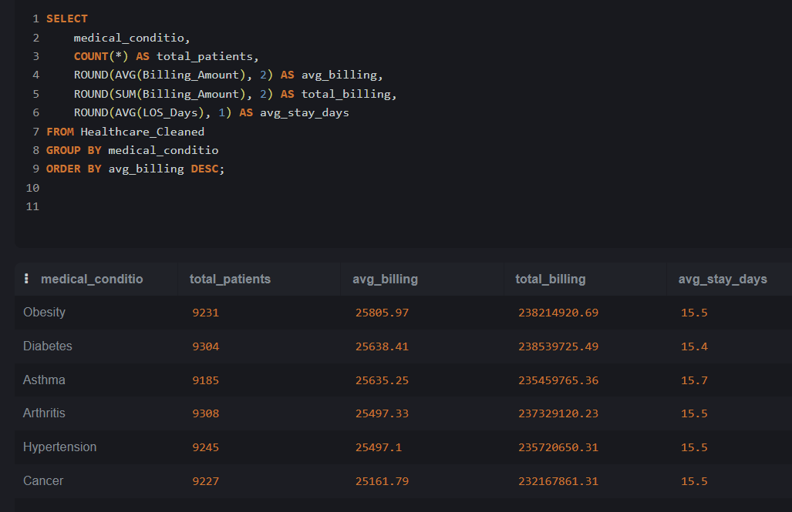
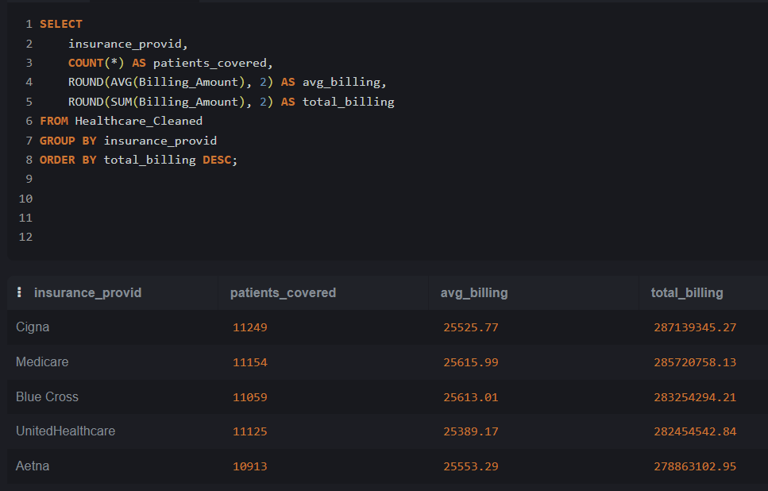

# 🏥 Hospital Patient Billing & Treatment Analytics

**Tools:** Excel | SQLite | Power BI  
**Dataset:** Healthcare Dataset (Kaggle — Prasad22)  
**Domain:** Healthcare Analytics | Hospital Operations  
**Records:** 55,500 patients | 6 medical conditions | 2019–2024  

---

## 📊 Dashboard Preview

### Executive Overview

### Clinical Analysis

### Financial & Insurance Analysis

---

## 🎯 Problem Statement

Hospitals manage thousands of patient records daily across 
multiple conditions, insurance providers, and admission types. 
This project analyzes 55,392 patient records to identify 
billing patterns, clinical outcomes, and operational insights 
to help hospital management improve resource allocation and 
revenue cycle management.

---

---

## 📁 Project Structure

| Folder | Contents |
|--------|----------|
| data/ | Cleaned CSV — 55,500 patient records |
| excel/ | Workbook with 8 helper columns + 5 pivot tables |
| sql/ | 3 SQL files + 4 query result screenshots |
| powerbi/ | 3-page dashboard .pbix + 4 screenshots |

---

## 🛠️ Tools & Techniques

### Excel
- Removed 108 negative billing rows (data quality fix)
- Fixed mixed-case patient names using PROPER() function
- Added 8 calculated columns: LOS_Days, Age_Group, 
  Billing_Category, High_Risk_Flag, Billing_vs_Avg, 
  LOS_Category, Admission_Year, Admission_Month
- Built 5 pivot tables with charts

### SQL (SQLite Online)
- 8 business queries using GROUP BY, CASE WHEN, 
  ROUND, AVG, SUM, COUNT, ORDER BY
- Identified billing patterns by condition, age group, 
  admission type, and insurance provider

### Power BI
- 3-page interactive dashboard
- CALENDARAUTO() date table
- 14 DAX measures
- Conditional formatting on tables
- Slicers for Year, Admission Type, Gender, 
  Insurance Provider, Billing Category

---

## 📈 Excel Pivot Analysis

### Billing by Medical Condition

### Test Results Distribution

### Yearly Admission Trend

---

## 🗄️ SQL Query Results

### Billing by Condition

### Insurance Provider Analysis

### Test Results Analysis
! [SQL_Test](sql/sql_test_results.png)

---

## 💡 Business Recommendations

1. **Prioritize Arthritis patients** for diagnostic resources 
   — 34.3% abnormal rate is highest across all conditions
2. **Review Asthma care pathways** — 15.7 day avg stay 
   suggests opportunity for earlier discharge protocols
3. **Prepare for seasonal surges** — 2020 data shows 
   hospitals need 53% capacity buffer for health emergencies
4. **Focus on Obesity prevention programs** — highest avg 
   billing at $25,806 suggests costly chronic management
5. **High Risk patient fast-track** — 6,091 Emergency + 
   Abnormal cases need dedicated rapid response protocol

---

## ▶️ How to Use This Project

1. Download "data/HealthCare_Cleaned.csv"
2. Open in Excel to see cleaned data with helper columns
3. Import CSV to SQLite Online (sqliteonline.com)
4. Run queries from "sql/03_business_analysis.sql"
5. Open "powerbi/HealthCare_Dashboard.pbix" 
   in Power BI Desktop (free)

---

## 📊 Dataset Information

- **Source:** Kaggle — Healthcare Dataset by Prasad22
- **Original Records:** 55,500
- **Columns:** 15 original + 8 engineered features
- **Note:** Patient names are synthetic/anonymized

---

## 👤 About

**Janak Ojha**  
Data Analytics Portfolio Project  
April 2026  
Data Analytics Portfolio Project  
April 2026  

